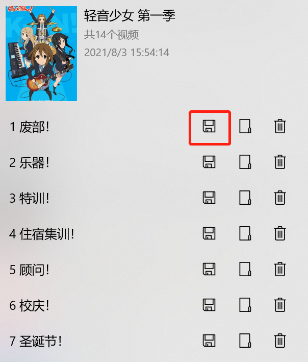
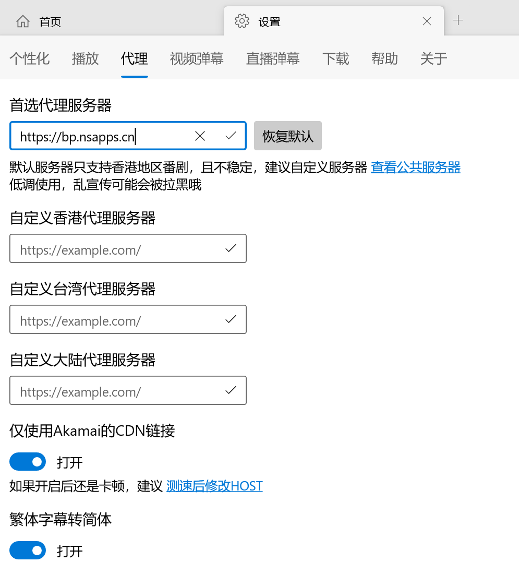
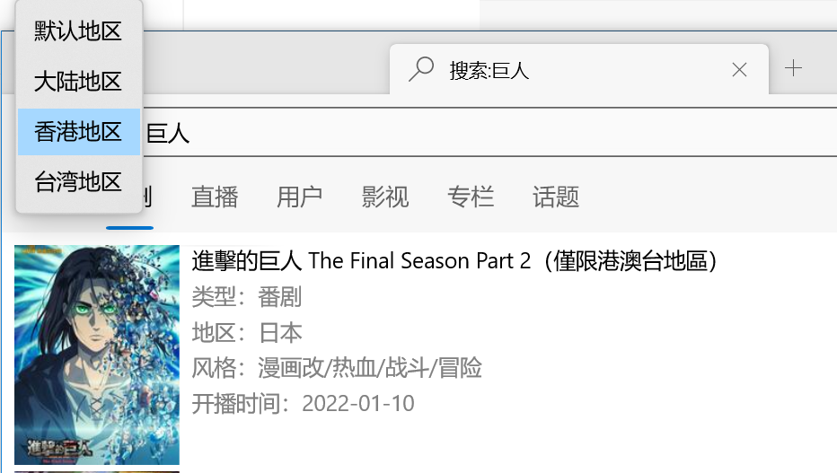

# 新特性说明

## Ver 4.4.0

### 1、导出下载的视频

`PS：该功能仅在x64测试通过。首次导出需要解压FFmpeg，可能会比较耗时`

原本下载视频为音视频分离的m4s文件，只能在客户端内播放。现在终于可以将它们导出为MP4文件，使用其他播放器播放了！

操作说明：

打开【下载】-【下载完成】选项卡，右键或长按需要导出视频，在弹出的菜单中，选择【导出视频】

如果是多集视频，则在需要导出的剧集上，点击【保存】按钮

### 2、按地区自定义服务器

打开【设置】-【代理】选项卡，输入各地区服务器即可，留空则使用首选服务器

### 3、按地区搜索

当你搜索不到想要的信息时，可以使用此功能。

在搜索框左侧选择服务器，该功能需要设置代理服务器。

